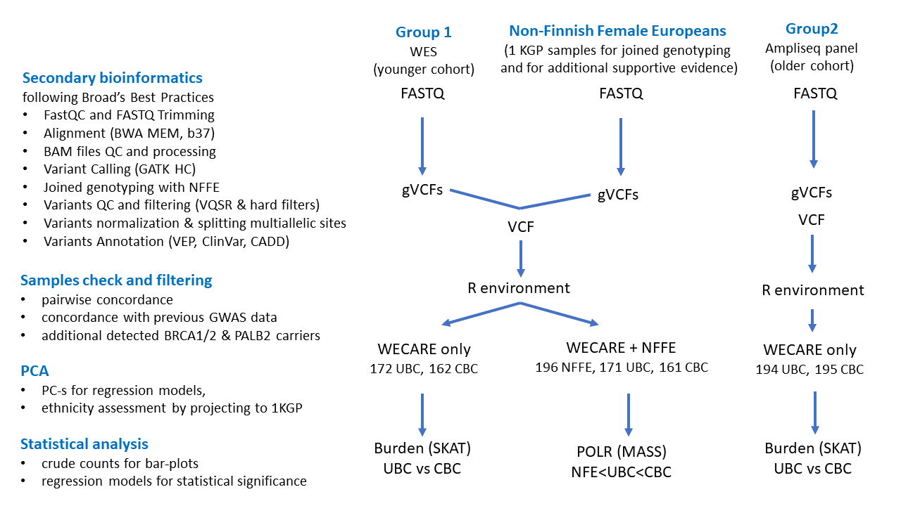

# Scripts used for WECARE manuscript

Alexey Larionov 27 Nov 2022

# Contents

[1 Overview](#1-overview)

[2 WES data analysis](#2-wes-data-analysis)

[2.1 From FASTQ to VCF](#21-from-fastq-to-vcf)

[2.1.1 Parallel execution on HPC cluster](#211-parallel-execution-on-hpc-cluster)

[2.1.2 Lane alignment and qc 3](#_Toc120455614)

[2.1.3 Merging bam-s from multiple lanes of sequencing for the same library 4](#_Toc120455615)

[2.1.4 BAMs pre-processing and generating gVCFs 4](#_Toc120455616)

[2.1.5 Combining gVCFs 5](#_Toc120455617)

[2.1.6 Joint genotyping and Variant Quality Score Recalibration 5](#_Toc120455618)

[2.1.7 Applying hard filters by QUAL and DP 5](#_Toc120455619)

[2.2 Variants annotation and import to R 6](#_Toc120455620)

[2.2.1 Splitting multiallelic sites 6](#_Toc120455621)

[2.2.2 Variants annotation 6](#_Toc120455622)

[2.2.3 Read VCF file into R 7](#_Toc120455623)

[2.2.4 Add phenotypes 7](#_Toc120455624)

[2.3 Statistical analysis of WES data 7](#_Toc120455625)

[2.3.1 Update and Cleaning 8](#_Toc120455626)

[2.3.2 Additional QC filtering 8](#_Toc120455627)

[2.3.3 Check relatedness and calculate PCA 8](#_Toc120455628)

[2.3.4 Crude counts 8](#_Toc120455629)

[2.3.5 SKAT 8](#_Toc120455630)

[2.3.6 Sub-analyses for PGV burdens depending on age and latency 9](#_Toc120455631)

[3 Joined analysis of WECARE WES and 1KGP NFFE data 9](#_Toc120455632)

[4 Analysis of Ampliseq panel data 9](#_Toc120455633)

[5 Metanalysis 9](#_Toc120455634)

# 1. Overview

The main steps of the data analysis are illustrated on the flowchart below:

There were two main branches of analysis: pipeline for processing WES data and pipeline for processing Am[pliseq data. An additional exploratory branch included a joined analysis of WES data from WECARE with WES data from Non-Finnish Female Europeans (NFE) from 1 thousand genomes project. The pipelines started from FASTQ files and followed the Broad's institute Best practices applicable at the time, including BWA alignment and GATK variant calling. The variant aggregation and regression modelling was performed using SKAT R package. Principal components for regression models were calculated using bigsnpr / bigutilsr packages. Checks for relatedness were performed using PLINK. Proportional Odds Logit Regression as implemented by MASS R package was used in the additional exploratory branch of analysis for joined WECARE and NFE data.

The scripts are available at this Github repository:

[https://github.com/alexey-larionov/wecare\_manuscript\_2022](https://github.com/alexey-larionov/wecare_manuscript_2022)

The conceptual approach to the rare variants statistical analysis (using SKAT library) was discussed in this lecture:

[https://embl-ebi.cloud.panopto.eu/Panopto/Pages/Viewer.aspx?id=67d6d21c-097e-4724-9e04-ae3900aab6c5](https://embl-ebi.cloud.panopto.eu/Panopto/Pages/Viewer.aspx?id=67d6d21c-097e-4724-9e04-ae3900aab6c5)

The remaining part of this document provides more details about main steps of analysis and describes the content of selected scripts.

# 2. WES data analysis

Scripts for WES data analysis are located in **f01\_wes\_fastq2vcf\_sh** , **f02\_wes\_annotate\_read2R** , **f03\_wes\_wecare\_R** and **f04\_wes\_wecare\_nfe\_R** folders (the last folder contains scripts for the additional exploratory branch of analysis)

## 2.1 From FASTQ to VCF

Scripts implementing BWA alignment and GATK variant calling for WES data are located in **f01\_wes\_fastq2vcf\_sh** folder.

### 2.1.1 Parallel execution on HPC cluster

These steps required most of the computational resources. So, they were implemented in a series of bespoke bash scripts executing analysis in parallel (parallelizing over multiple compute nodes on Cambridge University HPC cluster).

The analysis was split in several steps: scripts for each step are located in separate sub-folders with self-explanatory naming, indicating the sequence of the steps (p1, p2 etc). Each step was started after successful completion of the previous step confirmed by a manual assessment of the results and logs. The steps were started using start\_job.sh script (located in a01\_job\_templates folder), which was reading a configuration file with information about what analysis step to perform, the source files/samples, parameters for analysis, location for output etc. Examples (templates) for the job configuration files are also located in a01\_job\_templates folder. Numbering and naming of the provided templates correspond to the relevant steps of analysis. After reading the job config file, start\_job.sh script initiated the required step by launching a00\_start\_pipeline.sh script located in the sub-folder containing scripts for the requested step.

### 2.1.2 Lane alignment and qc

This was the first step of analysis. It is described here in detail. The other steps were implemented in a similar way.

Scripts for this step are located in the **p01\_wes\_lane\_alignment\_and\_qc** subfolder. As explained previously, the step is initiated by start\_job.sh script, which launches a00\_start\_pipeline.sh in this subfolder. In turn, a00\_start\_pipeline.sh script sequentially executes 3 steps:

1. Copying data from NAS boxes to HPC Cluster (s01\_copy\_and\_dispatch scripts)
2. Performing the analysis on Cluster (s02\_align\_and\_qc scripts), and
3. Copying data back from Cluster to NAS (s03\_summarise\_and\_save scripts).

Each of these steps was involving multiple samples (typically up to 24 samples sequenced on one line), which were processed in parallel: one sample per node. Launching the parallel jobs on cluster was managed by scripts with sb.sh extensions, while the actual analysis was performed by scripts with .sh extensions. Thus, omitting all the trivial IT steps for files copying, submitting jobs etc, all the actual bioinformatics steps for lane alignment and qc are coded in s02\_align\_and\_qc\_pe.sh script (s02\_align\_and\_qc\_se.sh script was used for single-end sequencing, which was not used for WECARE project). The content of s02\_align\_and\_qc\_pe.sh script is well structured and commented, so you can easily identify the following sections in the code:

- FastQC before trimming
- Trimming fastq files
- FastQC after trimming
- Alignment
- Sort by name
- Fixmate
- Sort by coordinate
- CleanSam
- FixBAMFile
- Add RG and index
- Validate bam
- Mark duplicates
- Collect flagstat metrics
- Collect inserts sizes
- Collect alignment summary metrics
- Collect hybridisation selection metrics
- Qualimap
- Samstat
- Remove mkdupped bams

The sections names are self-explanatory.

### 2.1.3 Merging bam-s from multiple lanes of sequencing for the same library

Each library was sequenced several times to get sufficient coverage (typically 4-6 times). So, this step was used to merge the multiple BAM files generated for each library. Scripts for this step are located in **p02\_wes\_library\_merge\_and\_qc** subfolder. Starting the scripts, copying data and submitting jobs to HPC cluster was implemented in a way similar to the previous step. So, omitting all ancillary scripts, the example of job description is available in TEMPLATE\_02\_wes\_library\_merge\_qc\_v2.job file ( **a01\_job\_templates** subfolder) and the code for actual data analysis is contained in s02\_merge\_and\_qc.sh script ( **p02\_wes\_library\_merge\_and\_qc** subfolder). Again, the script code is well structured and commented, so you can easily identify the following sub-steps:

- Merge
- Sort
- Mark duplicates
- Collect flagstat metrics
- Remove duplicates
- Index dedupped file
- md5 dedupped file
- Collect inserts sizes
- Collect alignment summary metrics
- Collect hybridisation selection metrics
- Qualimap
- Samstat

### 2.1.4 BAMs pre-processing and generating gVCFs

Following the Broad's Best Practices recommendations of the time, this step included two steps for BAMs pre-processing (local indel realignment and base quality score recalibration, bqr) followed by generating gVCF files (one per each sample in the library) using GATK haplotype variant caller. The scripts for this step are located in the **p03\_wes\_library\_preprocess\_gvcf** subfolder.

Omitting ancillary scripts for launching the job and submitting it to HPC cluster, the example of job description for this step is available in TEMPLATE\_03\_wes\_library\_preprocess\_gvcf\_v1.job file (a01\_job\_templates subfolder) and the code for actual data analysis is contained in s02\_preprocess\_and\_gvcf.sh script (p03\_wes\_library\_preprocess\_gvcf subfolder). It's easy to identify the following sections within the script:

- Performing local realignment around indels
- Making bqr tables before recalibration
- Performing bqr
- Making bqr tables after recalibration
- Making bqr plots
- Calling variants in gvcf mode

### 2.1.5 Combining gVCFs

The entire WECARE WES analysis included ~500 samples, which required tens of libraries for sequencing (20-24 samples per library). The previous steps (repeated for each library) generated one gVCF file per sample. The current step aggregated these individual gVCFs to multi-sample gVCFs, containing about 100 samples each (as recommended by Broad's best practices at the time). So, this step was repeated 5 times to combine ~500 individual gVCFs into 6 multi-sample gVCFs (one gVCF per 96xplate). The scripts for this step are located in **p04\_wes\_combine\_gvcfs** subfolder.

Omitting ancillary scripts used for submitting the job to HPC cluster, the example of job description for this step is available in TEMPLATE\_04\_wes\_combine\_gvcfs\_v1.job file (a01\_job\_templates subfolder). The actual code for combining gVCF files is contained in s01\_combine\_gvcfs.sh script (p04\_wes\_combine\_gvcfs subfolder) in the following section of the script:

- Combine gvcfs

Along with this code section, the script contains some ancillary sections for copying source files and results between NAS and HPC etc. No parallelisation was required starting form this step.

### 2.1.6 Joint genotyping and Variant Quality Score Recalibration

GATK joint genotyping performed using the combined gVCF files. 198 FASTQ files for Non-Finnish Female Europeans (NFFE) from One Thousand Genomes Project (1KGP) were processed along with WECARE samples using the same pipeline. Following the Broad's Best practices, the joint genotyping included all WECARE and 1KGP NFFE samples at the same time. This also facilitated the additional supportive analysis (WECARE vs NFFE) mentioned in the paper. The scripts for this step are located in **p05\_wes\_genotype\_vqsr** subfolder.

VQSR (Variant Quality Score Recalibration) was performed after joint genotyping, again, following the Broad's Best practices of the time.

The example of job description for this step is available in TEMPLATE\_05\_wes\_genotype\_vqsr\_v1.job file (a01\_job\_templates subfolder). The actual analysis code is in s01\_genotype\_vqsr.sh script (p05\_wes\_genotype\_vqsr subfolder) in the following sections of the script:

- Genotype gvcfs
- Trim variants (removes variants/alleles that have not been detected in any sample)
- Train vqsr snp model
- Apply vqsr snp model
- Train vqsr indel model
- Apply vqsr indel model

Along with these key sections, the script contains some ancillary sections for flagging multiallelic variants, making some bespoke QC plots, copying source files and results between NAS and HPC etc.

### 2.1.7 Applying hard filters by QUAL and DP

The scripts for this step are located in **p06\_wes\_hard\_filter** subfolder. This step includes some initial variant filtering. A number of additional variant QC filtering steps will be performed downstream (during the analysis part performed in R environment). At this step:

- QUAL was selected based on TsTv vs QUAL plot generated by bcftools stats (selecting QUAL threshold corresponding to TsTv ratio 2)
- DP was set wo 10x the number of samples (i.e. mean DP per sample \> 10)

The example of job description for this step is available in TEMPLATE\_06\_wes\_hard\_filter\_v1.job file (a01\_job\_templates subfolder). The actual analysis code is in s01\_hard\_filter\_vcf.sh script (p06\_wes\_hard\_filter subfolder) in the following sections of the script:

- Filter by QUAL and DP (add filter information into QUAL column of VCF file)
- Remove filtered variants from vcf (remove variants failed filters from VCF)

Along with these filtering sections, the script contains some ancillary sections for making bespoke QC plots, copying source files and results between NAS and HPC etc.

## 2.2 Variants annotation and import to R

Folder **f02\_wes\_annotate\_read2R** contains scripts for the following sub-folders with self-explanatory names:

- s00\_check\_source\_data
- s01\_split\_multiallelic\_sites
- s02\_annotate
- s03\_read\_to\_R
- s04\_add\_phenotypes

Except for the last step, these scripts were performed on HPC cluster. However, none of the steps required parallelisation on several compute nodes. The last step was performed on a personal workstation. Most of the folders contain both: scripts and logs. Logs for Shell scripts are recorded in plain text format. Logs for RMD scripts are rendered in HTML format. HTML files could be viewed by downloading on your PC, or directly on GitHub by pasting their URL at GitHub html preview page [https://htmlpreview.github.io/](https://htmlpreview.github.io/).

### 2.2.1 Splitting multiallelic sites

Sub-folder **s01\_split\_multiallelic\_sites** contains two short Shell scripts (and logs) with self-explanatory names:

- s01\_split\_multiallelic\_sites.sh
- s02\_clean\_star\_in\_alt.sh

VCF specification uses \* in Alt field for variants overlapping upstream deletions. This \* is perceived as an alternative allele, which is recorded in a separate line when splitting the multiallelic sites. These lines are removed by the second script.

### 2.2.2 Variants annotation

Subfolder **s02\_annotate** contains a number of shell scripts that add several layers of variant annotations to the VCF file.

#### 2.2.2.1 s01\_add\_tags\_check\_ac.sh

This script recalculates tags like AC, AN, AF etc in the INFO field. This is necessary because these tags were removed in multi-allelic variants during splitting.

#### 2.2.2.2 s02\_add\_ids.sh

Unique variant IDs are necessary for the down-stream analysis. RS-numbers can not be used as such IDs because they are not available for many variants, which are not in DBSNP yet. So, the IDs in form of 'CHROM\_POS\_REF\_ALT' are added (they are unique after splitting multiallelic sites).

#### 2.2.2.3 s03\_check\_clinvar\_chr.sh

It's a short script that checks consistency of chromosome naming in WECARE VCF and ClinVar VCF before adding ClinVar annotations.

#### 2.2.2.4 s04\_annotate\_with\_clinvar.sh

Adding all annotations available in the ClinVar database (there are more annotations in the original ClinVar database, than could be later added by VEP).

#### 2.2.2.5 s05\_annotate\_with\_vep.sh

This script adds all variant annotations available in Ensembl VEP tool, including VEP gene symbols, variant consequences, SIFT, PoliPhen etc. Also this script uses VEP CADD plugin to add CADD scores.

#### 2.2.2.6 s06\_split\_vep.sh

VEP adds its annotation to VCF file as a CSQ field into INFO column. To facilitate downstream import in R, this field is split into separate INFO columns (using bcftools split-vep plugin).

### 2.2.3 Read VCF file into R

Subfolder **s03\_read\_to\_R** contains two R scripts (in Rmd format) to import and explore data, and two shell scripts to run Rmd in a non-interactive way on (they were executed on HPC for WES data).

#### 2.2.3.1 s01\_import\_vcf\_to\_R.Rmd

This file uses VCFR library to import VCF to R. It is launched on a compute of HPC cluster by s01\_run\_rmd.sh script. RMD files are well structured and commented. They could be viewed by RStudio.

#### 2.2.3.2 s02\_explore\_data\_in\_R.Rmd

Check size of data and selected imported fields (such as FILTER, QUAL and RS numbers) to ensure the expected content/ranges. RMD script was launched ona compute node of HPC cluster using s02\_run\_rmd.sh Shell script.

### 2.2.4 Add phenotypes

Sub-folder **s04\_add\_phenotypes** contains two Rmd scripts: the first one adds phenotype annotations provided by WECARE consortium, and the second one removes all samples that should be excluded from the final analysis (such as duplicate samples added for QC, samples that potentially carried BRCA1/2 or PALB2 variants, remaining samples with potential QC issues etc).

## 2.3 Statistical analysis of WES data

Folder **f03\_wes\_wecare\_R** contains scripts for statistical analysis, split into the following sub-folders with self-explanatory names:

- f00\_functions
- s04\_select\_samples
- s05\_update\_and\_cleaning
- s06\_qc\_filters
- s07\_relatedness\_and\_pca
- s08\_crude\_counts
- s09\_skat
- s10\_age\_or
- s11\_latency\_or

Numbering starting from 04 is not a typo (it happened for historical reasons). Most of the sub-folders contain both: scripts and logs. Logs for Shell scripts are recorded in plain text format. Logs for RMD scripts are rendered in HTML format. HTML files could be viewed by downloading on your PC, or directly on GitHub by pasting their URL at GitHub html preview page [https://htmlpreview.github.io/](https://htmlpreview.github.io/).

Sub-folder **s04\_select\_samples** doesn't contain any scripts. It only contains a note about copying the source data produced after samples selection at the previous step. Sub-folder f00\_functions contains functions used by scripts in the other sub-folders.

### 2.3.1 Update and Cleaning

Sub-folder **s05\_update\_and\_cleaning** contains three Rmd scripts. The first script calculates additive genotypes matrix (encoded 0,1 and 2) and a matrix with Alt allele fractions, which will be later used for additional filtering. The second script makes sure that table with variants annotations has proper encoding of missed values and proper data types for variables. The lar script does similar data cleaning for the phenotypes table.

### 2.3.2 Additional QC filtering

**Sub-folder s06\_qc\_filters** contains scripts with self-explanatory names:

- s01\_filter\_by\_dp\_and\_gq.Rmd
- s02\_filter\_by\_alt\_fraction.Rmd
- s03\_filter\_by\_variant\_call\_rates.Rmd
- s04\_filter\_by\_sample\_call\_rates.Rmd

### 2.3.3 Check relatedness and calculate PCA

The first two scripts in folder **s07\_relatedness\_and\_pca** (s01\_make\_ped\_map.Rmd and s02\_make\_bed\_bim\_fam.sh) convert data to appropriate PLINK format. Scritp s03\_check\_related.sh calculates KING relatedness coefficients using PLINK. The next two scrips (s04\_calculate\_PCs.Rmd and s05\_projection\_to\_1kgp.Rmd) use bigsnpsr and bigutilsr R packages to calculate principal components and to project the WECARE samples to space of 1000 genomes populations. Finally (s06\_update\_main\_dataset.Rmd) the calculated PCs are added to the main dataset that will be used later for downstream statistical analysis.

### 2.3.4 Crude counts

Scripts in folder **s08\_crude\_counts** calculate crude allelic frequencies, ORs and proportions of carriers, which are used later for visual assessment and summaries (but not for estimating the statistical significance).

### 2.3.5 SKAT

Finally, the script in folder **s09\_SKAT** calculates the statistical significance test for enrichment of aggregated variants between CBC and UBC. The concepts behind this calculation were discussed in detail in the lecture that one of the co-authors gave in EBI in 2022:

[https://embl-ebi.cloud.panopto.eu/Panopto/Pages/Viewer.aspx?id=67d6d21c-097e-4724-9e04-ae3900aab6c5](https://embl-ebi.cloud.panopto.eu/Panopto/Pages/Viewer.aspx?id=67d6d21c-097e-4724-9e04-ae3900aab6c5)

### 2.3.6 Sub-analyses for PGV burdens depending on age and latency

Scripts for these sub-analyses are included sub-folders **s10\_age\_or** and **s11\_latency\_or**.

# 3. Joined analysis of WECARE WES and 1KGP NFFE data

The additional supportive analysis on the joined dataset of WECARE WES and 1KGP NFFE data was performed in the same way as the WECARE only data analysis described above sections (except POLR was used to estimate the statistical significance instead of SKAT). The scripts for the joined analysis are in the folder **f04\_wes\_wecare\_nfe\_R**.

POLR was calculated using MASS R library. Because MASS is a generic statistical library, it does not include functions for pre-processing genetic data. So, the genotypes were imputed, weighted and aggregated using a bespoke code emulating implementation of these steps in SKAT (see sub-folder **s09\_polr** ).

# 4. Analysis of Ampliseq panel data

The Ampliseq panel data were analysed in a way similar to the WES data analysis described above, except for minor deviations required by the different nature of data (e.g. GATK down-sampling was suppressed for Ampliseq variant calling and filtering). The scripts for Ampliseq data analysis are located in folders **f05\_ampliseq\_fastq2vcf\_sh** , **f06\_ampliseq\_annotate\_sh** and **f07\_ampliseq\_wecare\_R**. The files and sub-folders naming is similar to described above for WES analysis. Scripts from folder **f08\_ampliseq\_wecare\_nfe\_R** were not used for the manuscript because Ampliseq panel data are not compatible for 1KGP WES NFFE data.

# 5. Metanalysis

Scripts and notes for metanalysis are located in the folder **f09\_metaanalysis**.